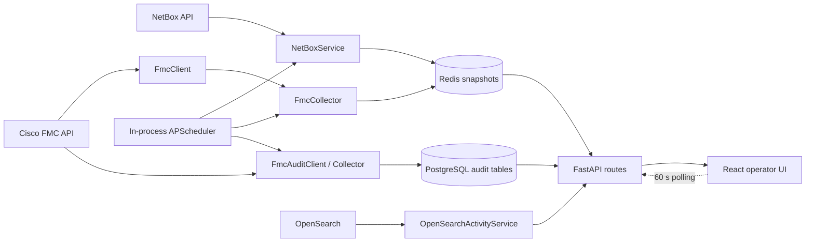
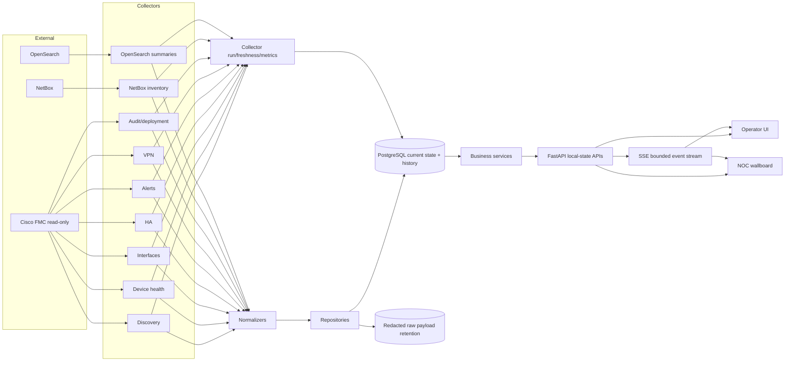

# NetLens NOC technical audit

Audit date: 2026-08-01  
Scope: `/Users/orkhan/PycharmProjects/netlens`  
Status: baseline findings retained below; implementation status is recorded in
`IMPLEMENTATION_REPORT.md`. Production readiness remains conditional on the external FMC
permission fix and the listed validation gaps.

## Executive summary

NetLens currently consists of a FastAPI backend, React/Vite frontend, Redis cache,
PostgreSQL, APScheduler, and clients for NetBox, FMC, and OpenSearch. The NetBox and
OpenSearch features predate the recently added FMC monitoring and audit modules. FMC
monitoring is currently snapshot/cache based and the audit module is the only FMC area
with relational persistence.

The current system must not be used as an authoritative 24/7 NOC view. Missing values,
collection errors, and actual zero values are not represented consistently; FMC health
data has no historical persistence; collectors do not have independent freshness state;
and the HTTP dashboard path can trigger a full live FMC scan on cache miss.

The first live read-only diagnostic found 74 device records. The aggregate metrics
endpoint returned HTTP 403 (`The user is not authorized`) for the tested current device
UUID. The existing client converts neither 403 nor its FMC error payload to a typed
result, so the permission cause is lost. The API mapper then emits artificial zero
interface counters, making unavailable data look real.

## Current architecture

### Backend

- FastAPI application in `backend/app/main.py`.
- Pydantic settings in `backend/app/core/config.py`.
- NetBox, OpenSearch, FMC monitoring, and FMC audit integrations under
  `backend/app/integrations/`.
- One in-process `AsyncIOScheduler` mixes scanner, NetBox inventory, FMC full scan,
  VPN refresh, and audit jobs.
- Redis stores NetBox/FMC JSON snapshots.
- PostgreSQL currently stores only audit/deployment/user-stat records.
- Database schema is created with `Base.metadata.create_all`; there is no migration
  framework or versioned production migration path.

### Frontend

- React 19, React Query, Recharts, and Vite.
- FMC monitoring refreshes with 60-second polling.
- Current charts are generated from the latest dashboard snapshot, not time series.
- There is an operator-style monitoring page, but no production wallboard, HA workspace,
  alert lifecycle workspace, VPN incident history, or freshness/dependency view.

### Deployment

- Docker Compose provides PostgreSQL, Redis, backend, and nginx frontend.
- PostgreSQL and Redis have healthchecks.
- Backend and frontend have no healthcheck/readiness gate or restart policy.
- Backend image runs a single in-process scheduler with no distributed lock. Multiple
  backend replicas would run duplicate collectors.

## Existing working components

- FastAPI routing, Keycloak/JWT integration, and CORS plumbing.
- NetBox inventory cache and device-detail endpoints.
- OpenSearch aggregation/export/reporting features.
- Network scanner and scanner profile storage.
- Read-only FMC authentication, device pagination, device/interface/HA/chassis endpoint
  wrappers, and bounded per-device collection.
- Basic FMC dashboard UI, latest VPN snapshot, and 60-second React Query refresh.
- Initial FMC audit ORM/service/routes and Asia/Baku timezone utilities.
- Baseline frontend production build succeeds.

These components should be evolved, not replaced without evidence.

## Critical bugs

### Aggregate metrics and device correctness

1. `get_aggregate_metrics(..., retries=1)` cannot perform the documented retry path.
   A 5xx sleeps once, exits the loop, and raises a generic runtime error.
2. A temporary aggregate failure is cached as permanently unsupported for the life of
   that client, explicitly violating the required capability behaviour.
3. HTTP 403 is not classified by the client. The structured FMC permission response is
   lost and the frontend cannot display `Error`/`Permission`.
4. No per-category aggregate fallback (`CPU`, `MEM`, `INTERFACE`, `DISK_STATS`,
   `CHASSIS_STATS`) exists.
5. Operational fallback requests CPU only. Memory is never attempted.
6. The detail response ID is not checked against the requested UUID.
7. Discovery does not classify dummy/container/stale/disconnected/duplicate records.
8. Exceptions returned by per-device `gather` are discarded without a device-level
   failed result or diagnostic record.
9. `fanRpmAvgList` is parsed from `rpmAvg`, while the observed/OAS field is `rpm`.
10. The API chooses `linaPercent` as the headline CPU/memory value rather than preserving
    and exposing lina/snort/system separately.
11. The API mapper assigns `0` to absent RX/TX/drop counters.
12. Aggregate block presence and partial parse state are not exposed.

### Request path and caching

1. `/monitoring/dashboard` initiates a full live FMC scan on cold cache. This can exceed
   normal API latency targets and couples FMC availability to frontend requests.
2. Full FMC data has a 24-hour TTL without an explicit `collected_at` freshness contract.
3. Cache exceptions are silently swallowed. Operators cannot distinguish Redis failure
   from an empty cache.
4. VPN collection exceptions are silently swallowed and old/empty data can be presented
   without source state.
5. A new service/client/collector is constructed per dashboard request.

### HA, VPN, alerts, and audit

1. HA stores configured primary/secondary fields but has no reliable runtime active/
   standby model, member metrics, degraded-state derivation, or transition history.
2. Unreachable HA detail/monitored-interface endpoints are silently ignored.
3. VPN data is a latest snapshot; transitions, outage duration, availability, flapping,
   MTBF, and MTTR do not exist.
4. Alerts are fetched per device and kept only in the latest dashboard snapshot.
5. Audit routes use `_cfg` (`fmc_config`) for endpoints specified under `fmc_platform`.
6. Audit config-change retrieval is absent; raw `recordId`, `auditId`, and `snapshotId`
   are not modeled separately.
7. Audit persistence relies on `fmc_id` alone and assumes it is the stable unique key.

### Scheduler and process lifecycle

1. Device discovery, detail, health, interfaces, HA, alerts, and chassis are one large
   full scan rather than independent failure domains.
2. Full health scan cadence defaults to once daily, not the required 30–60 seconds.
3. Job history is an in-memory deque and disappears at restart.
4. No distributed lock protects jobs when more than one backend instance is running.
5. Startup DB failure is downgraded to a warning even though DB-backed audit endpoints
   remain registered.
6. Scheduler disabled-state logic considers some jobs but omits the audit flag.

## Data correctness risks

- `None`, missing, error, unsupported, stale, and zero do not have one shared typed model.
- No metric row includes collection run, source, window, or per-metric status.
- Aggregate interface matching is name based and does not prioritize runtime UUID.
- Case-insensitive fallback matching can merge ambiguous interface names.
- NetBox and FMC have no persisted correlation model or manual override.
- NetBox inventory is cache based; stale/removed device handling is not persisted.
- Latest snapshot charts can imply a time series that does not exist.
- Raw responses are held in an unbounded in-memory list for each client and have no
  retention, redaction, persistence, or byte limit.

## Scalability risks

- A new `httpx.AsyncClient` is created for authentication and each logical GET call;
  connection pooling is not reused across a collection run.
- A global one-request-per-second throttle serializes all FMC calls even when bounded
  safe concurrency would be supported.
- Alerts and interface configuration are fetched for every device in the same cycle.
- The dashboard returns all devices and nested data without server-side pagination.
- Frontend production bundle is approximately 867 KB minified and is not route-split.
- OpenSearch service and scanner pipeline are large multi-responsibility modules.

## Operational risks

- No `/health/live`, `/health/ready`, or `/health/dependencies` contract.
- No Prometheus/OpenMetrics endpoint or durable collector-run/source-freshness records.
- No scheduler lag, dependency latency, database error, missing metric, or websocket
  telemetry.
- Docker backend/frontend lack healthchecks and restart policies.
- Redis and PostgreSQL Compose passwords have insecure defaults.
- No retention jobs exist for raw responses, metrics, alerts, or transitions.
- Silent exception handlers exist across FMC, OpenSearch, scanner, cache, and GeoIP paths.

## Security risks

- Real NetBox, OpenSearch, and FMC secrets are present in source defaults and Compose
  fallbacks; an FMC password is also present in documentation.
- A tracked `backend/build/` artifact contains stale source and secrets.
- TLS verification defaults to disabled for internal integrations.
- FMC diagnostic script logs a token prefix.
- Frontend bearer tokens are stored in `localStorage`, increasing impact of XSS.
- Scheduler mutation endpoints do not yet express granular RBAC permissions.
- No application-level rate limiting or export permission is visible.
- Existing exposed credentials must be rotated outside this code change after removal.
- Tracked scanner/test datasets contain internal IP data and require an explicit data-
  classification and repository-retention decision.

## Missing production features

- Persisted current state and time-series metric repository.
- Source freshness and collector run models.
- NetBox/FMC correlation with method, confidence, matched fields, manual override, and
  last verification.
- Typed metric/capability/error states and raw response retention.
- Independent health, HA, alert, VPN, audit, deployment, NetBox, and OpenSearch collectors.
- HA member health and role-transition history.
- Alert lifecycle/history and analytics.
- VPN transitions, incidents, availability, MTBF/MTTR, and flapping analytics.
- Audit config changes, before/after normalization, sessions, and deployment correlation.
- SSE/WebSocket real-time delivery with reconnect/heartbeat/backpressure.
- Operator drill-down and large-screen wallboard modes.
- Versioned migrations, retention jobs, runbook, rollback procedure, and load/failure tests.

## Baseline verification

- Backend: 39 tests pass, 5 fail. Failures cover removed OpenSearch compatibility
  methods, scheduler disabled-state assumptions, environment-dependent configuration,
  and a test that downloads an OUI database from the internet.
- Ruff: the current tree has pre-existing lint failures, including long lines, unused
  imports, and broad/silent exception handling.
- Frontend: TypeScript/Vite production build succeeds; Vite warns that the main chunk is
  larger than 500 KB.
- Live FMC read-only diagnostic: device discovery returned 74 records. Aggregate metrics
  returned HTTP 403 with an FMC permission message for the sampled current UUID. No
  token or credential was logged.

## Implementation plan

### Phase 1 — correctness

1. Remove source/Compose/documentation secrets and document mandatory environment
   settings; require credential rotation operationally.
2. Introduce typed FMC request outcomes and error classification, reusable HTTP client,
   bounded retry/backoff, redacted diagnostics, and expiring capability observations.
3. Validate discovery/detail UUIDs and classify dummy/container/disconnected/stale/
   duplicate devices without unsafe fuzzy merges.
4. Extract aggregate normalizer; preserve missing versus zero; implement per-category and
   operational CPU/memory fallback; expose partial status.
5. Correct interface and fan parsing/matching and remove fabricated zeros from the API/UI.
6. Persist collector runs/source freshness/raw diagnostic metadata and stop live FMC work
   in dashboard request paths.

### Phase 2 — history

Add versioned PostgreSQL migrations and repositories for current device state, metric
samples, interface samples, VPN transitions, alert observations, raw-response metadata,
and retention-safe indexes.

### Phase 3 — HA and alerts

Split HA and alert collectors, persist configured/runtime roles and transitions, derive
pair state, and add separate HA/Health Alerts APIs and operator workspaces.

### Phase 4 — VPN analytics

Persist tunnel state changes, calculate outage/availability/flapping/MTBF/MTTR, and build
bounded timeline/histogram/incident APIs and UI.

### Phase 5 — real-time dashboards

Use SSE for one-way bounded dashboard invalidation/events, with heartbeat, event IDs,
exponential reconnect, and periodic polling fallback. Add operator and wallboard modes
backed only by local state/history.

### Phase 6 — audit

Correct platform endpoints, persist raw identifiers and aliases, retrieve config changes,
produce fact/normalized/heuristic layers, and add timeline/session/object/diff/deployment
views.

### Phase 7 — production hardening

Add dependency health/readiness, structured logging/metrics, distributed job locking,
retention, RBAC/rate limits, Docker health/restart policies, load/failure recovery tests,
deployment/runbook/environment/rollback documentation, and known limitations.

## Architecture target

## Immediate operational action outside the repository

Rotate the exposed NetBox token and FMC/OpenSearch passwords, then provision a read-only
FMC account authorized for the health endpoints required by NetLens. Secret rotation and
FMC RBAC changes are operational tasks and are intentionally not performed by this
read-only integration hardening work.
